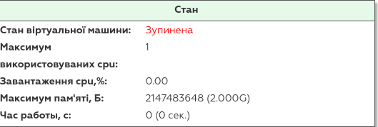
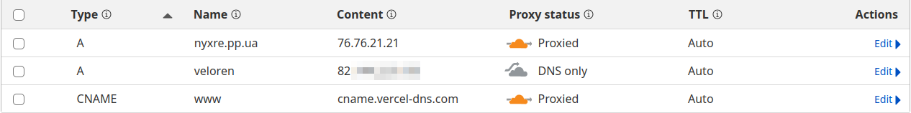

# Інцидент 21.01.25

Я вас вітаю. О ***21.01.2025 ~10:30*** було помічено те, що ігровий сервер `veloren.nyxre.pp.ua` не відповідає на запити від клієнтів. О 12 годині розпочалися роботи над відновленням серверу, і самі роботи тривали близько 2 годин.

Але це не вся історія, тому...

## Початок інциденту та самі причини

Сам інцидент почався о ***19.01.25***, внаслідок змін DNS записів у панелі Cloudflare, де випадково було увімкнена переадресація з `veloren.nyxre.pp.ua` до IP-Адреси ігрового сервера через проксі Cloudflare.

Чому важливо аби проксі від Cloudflare було вимкнене саме для ігрового серверу? Все просто, *Veloren не підтримує протокол зв'язку TLS*, який використовується при передачі інформації між клієнтом та веб-сервером (так зване, SSL підключення.), а при використанні проксі Cloudflare - сам сервіс шифрує усю надходячу інформацію за протоколом TLS 

## Наслідки для користувачів

Праця веб-сайту не була порушена внаслідок вищеперелічених змін, так як веб-сервер *підтримує* протокол TLS, на відміну від ігрового сервера Veloren, де, через тимчасові проблеми з DNS записами - неможливо було приєднатися з-за допомоги домену `veloren.nyxre.pp.ua`.

На цей момент, усі записи були відредаговані, та домен `veloren.nyxre.pp.ua` нарешті переадресовує на ігровий сервер з Veloren.

## Рішення

Спочатку, ми думали що ігровий сервер треба перезавантажити, що ми й зробили.

Але, це твердження виявилося хибним, бо, *проблема була у переадресуванні користувачів на IP-Адресу ігрового серверу, а не у самому сервері.

Справжнім рішення було те, що нам треба було відредагувати DNS записи нашого домену таким чином, як це зображено зараз на скріншоті.

## Висновки

Висновки з цього інциденту були зроблені наступні...

1. Перед тим, як робити велику зміну у записах домену - треба перепровірити бажані зміни. 
2. Після змін записів домену - треба перевірити роботу усієї інфраструктури.
