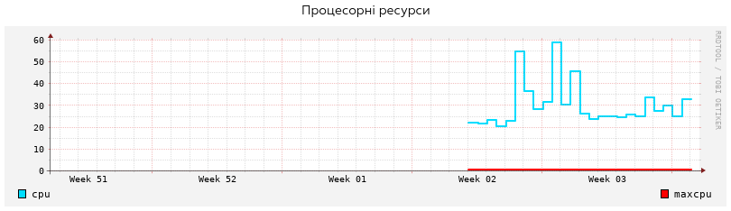
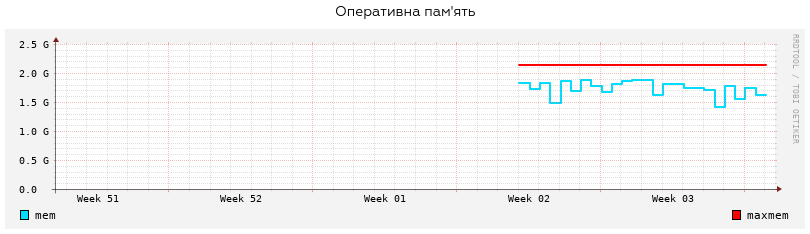
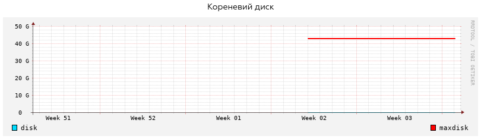
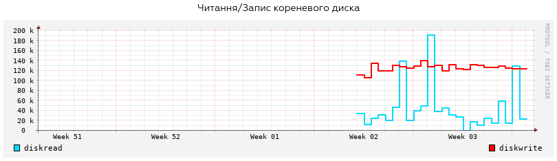
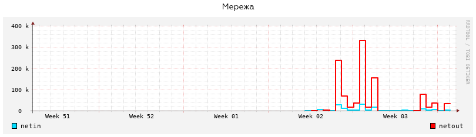
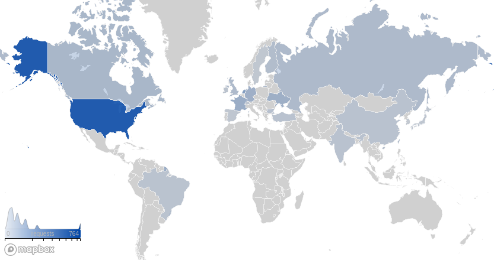
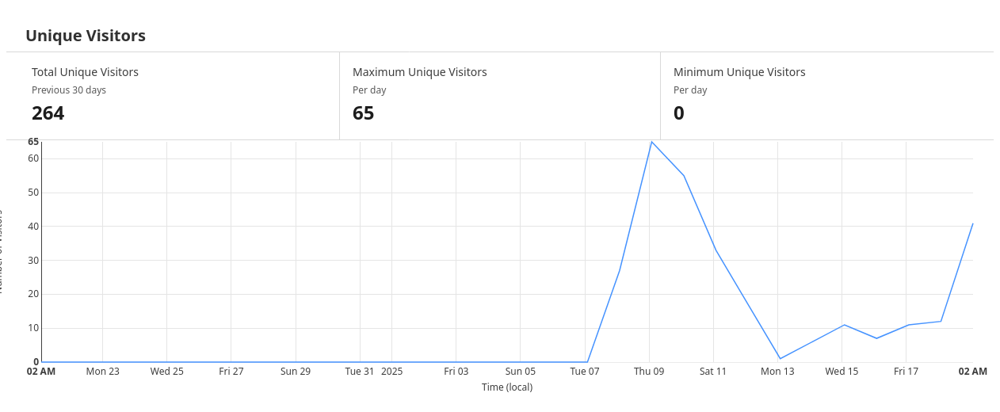
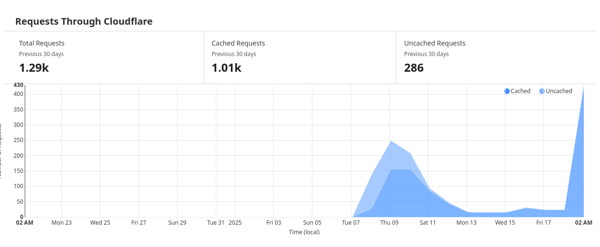
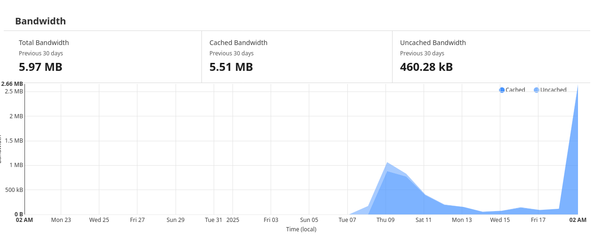

Всім привіт, з вами Олександр, і сьогодні я хочу вам презентувати... ***щомісячну статистику!***

# Інфраструктура

Загалом, перед тим як ми почнемо, то розкажу вам про нашу інфраструктуру, аби все було зрозуміло. *Усі пункти позначають різні сервера, де зберігається сама "послуга".*

1. **Ігровий сервер**

    Ігровий сервер на цей момент використовує ресурси нашого VPS, яке ми арендуємо у [ТОВ "ВОЛЯ-КАБЕЛЬ"](https://dc.volia.com/), але, у нас запланована зміна провайдера на [Hetzner Online GmbH](https://www.hetzner.com/).
    
2. **Веб-сайт**

    Веб-сайт побудований на шаблоні, який є у вільному доступі у Гітхабі
    ::github{repo="saicaca/fuwari"}
    Саме "залізо" надається сервісом [Vercel](https://vercel.com/), яке надає нам можливість не заморачуватися з ручним деплойментом коду, і все що нам треба зробити - це оновити код у репозиторії Гітхаб, і все.

3. **Проксі та менеджер DNS від Cloudflare**

    Щож, так, ми використовуємо *безкоштовний* тариф Cloudflare, аби керувати нашими DNS записами, та, захищати веб-сайт від ДДоС атак.
    
    Наприклад, у нас є домен veloren.nyxre.pp.ua, але, він не був спочатку прив'язаний до ігрового сервера, тож, нам треба зробити A запис, вказати сам домен та IP ігрового сервера. (У випадку з IPv6 - AAAA запис)
    
Щож, все наче пояснив, тому, приступаємо до...

# Статистика

## Статистика ігрового серверу

### Використання процессору

:::important[ВАЖЛИВО]
maxcpu показує не вірні дані. 60 - є найбільшим значенням.
:::

Щож, тут ми бачимо, що коли на сервері грає ~*4* людини, то, сервер занадто сильно навантажується, звичайно, не доходить до крашу сервера, але, потреба у новому сервері існує.

### Використання оперативної пам'яті

Тут ми бачимо, що сервер загалом використовує майже усю оперативну пам'ять, але, це не є критичним, бо сама гра не споживає багато оперативної пам'яті.

### Використання кореневого диску

Ми не використовуємо багато пам'яті. Сам сервер використовує ~1 ГБ пам'яті.

### Читання та запис кореневого диска

На піку онлайна у ~*4* людини, сервер читає ~*200кБ* заради того аби завантажити чанки, в яких знаходяться гравці. 

### Використання мережі

На піку онлайна, ми використовуємо ~*325кБ* мережі у годину. Причина цього - ігрові клієнти користуються клієнто-орієнтованою фізикою, при наявності опції серверно-орієнтованої фізики.

## Статистика веб-сайту

### Запити до веб-сайту по країнам

:::important[ВАЖЛИВО]
Запити до веб-сайту ≠ гравці серверу або перегляд веб-сайту. **Гравці з РБ та рФ заблоковані фаерволом, і не можуть отримати доступ до веб-сайту та ігрового серверу.**
:::

### Унікальні перегляди веб-сайту

### Кількість запитів

### Використання мережі

