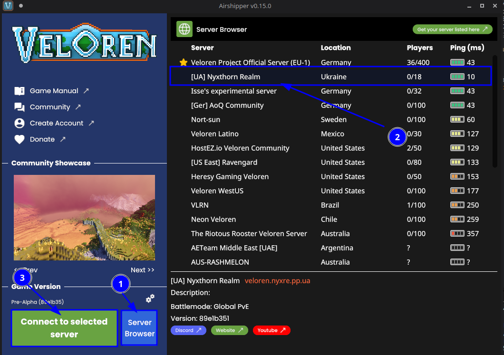
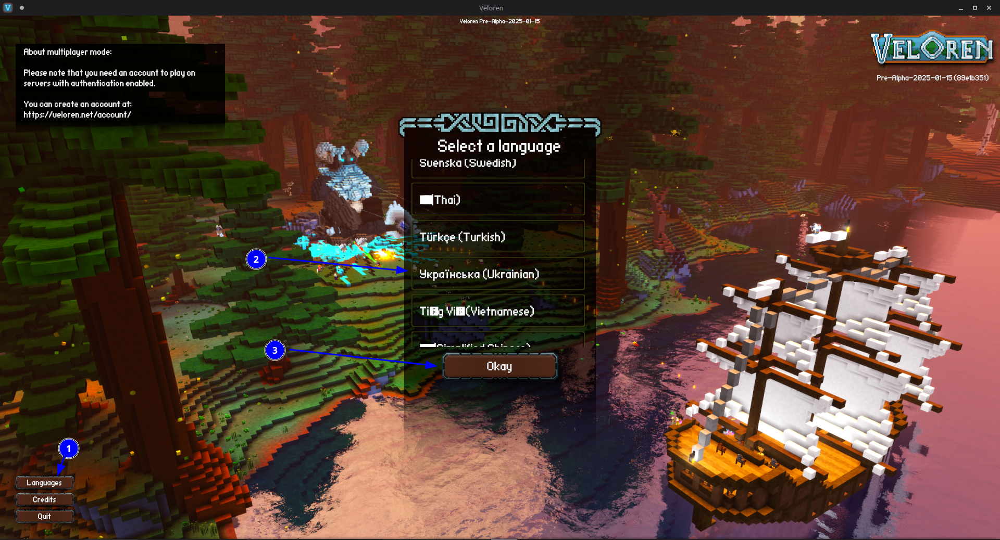
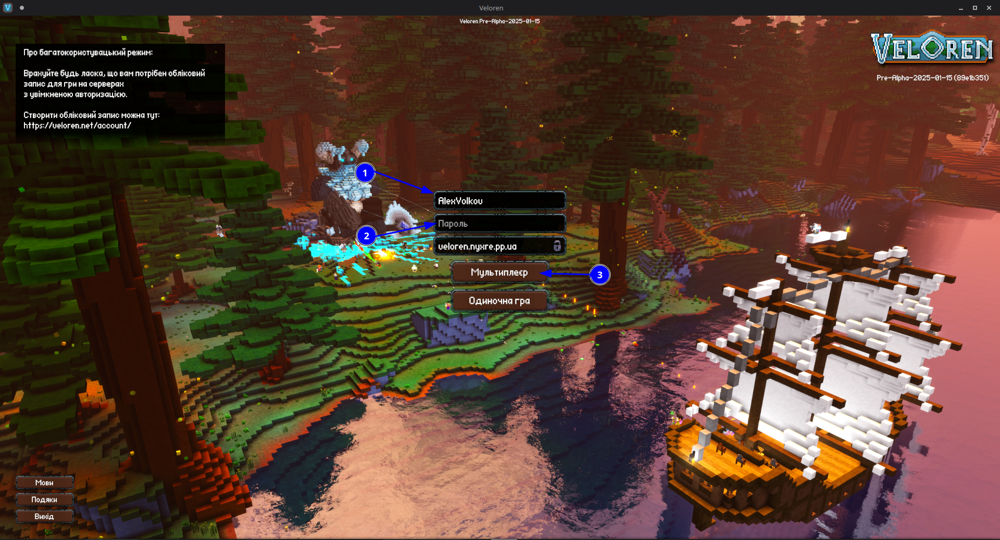

# Як приєднатися до нашого серверу?

## Основні вимоги 

Привіт! Тож, для того аби приєднатися до нас на сервер тобі треба мати наступні речі:
* Встановлений [Airshipper](https://veloren.net/download/)
* Офіційний аккаунт, який можна зареєструвати [тут!](https://veloren.net/account/create-account/)

Якщо ж у тебе все є, то, переходимо до наступного пункту!

## Тож, як все таки приєднатися?

А все просто! Аби приєднатися до нас на сервер, то треба зайти у `Server Browser`, знайти `[UA] Nyxthorn Realm`, натиснути на строку з сервером та натиснути на кнопку `Connect to selected server`.

Після цього, перед вами буде екран авторизації, який й слугує головним екраном гри.

У грі також існує українська локалізація. Якщо ви хочете змінити мову на українську - натисність на кнопку `Language`, після чого у вас відкриється меню вибору мови, пролистайте униз допоки не побачите `Українська (Ukrainian)`, натисніть на українську і після цього натисніть на `Окей` аби зачинити це меню.

І тепер, аби зайти на сервер введіть ваш нікнейм (який ви використали при реєстрації аккаунта) у поле `Ім'я користувача` (`Username` англійською), та пароль у поле `Пароль` (`Password` англійською). Після того як ви зробили все - натисність на кнопку `Мультиплеєр` (`Multiplayer` англійською)

Щож, ви нарешті приєдналися до нашого серверу, але, як щодо поринути ще більше у нашу спільноту? Для цього, у нас існує наша [Discord спільнота](https://discord.gg/5WSj5QkdPn) :>

Але у будь-якому випадку, бажаю вам успіху у ваших подорожах по безкрайньому всесвіті Ніксторну!
